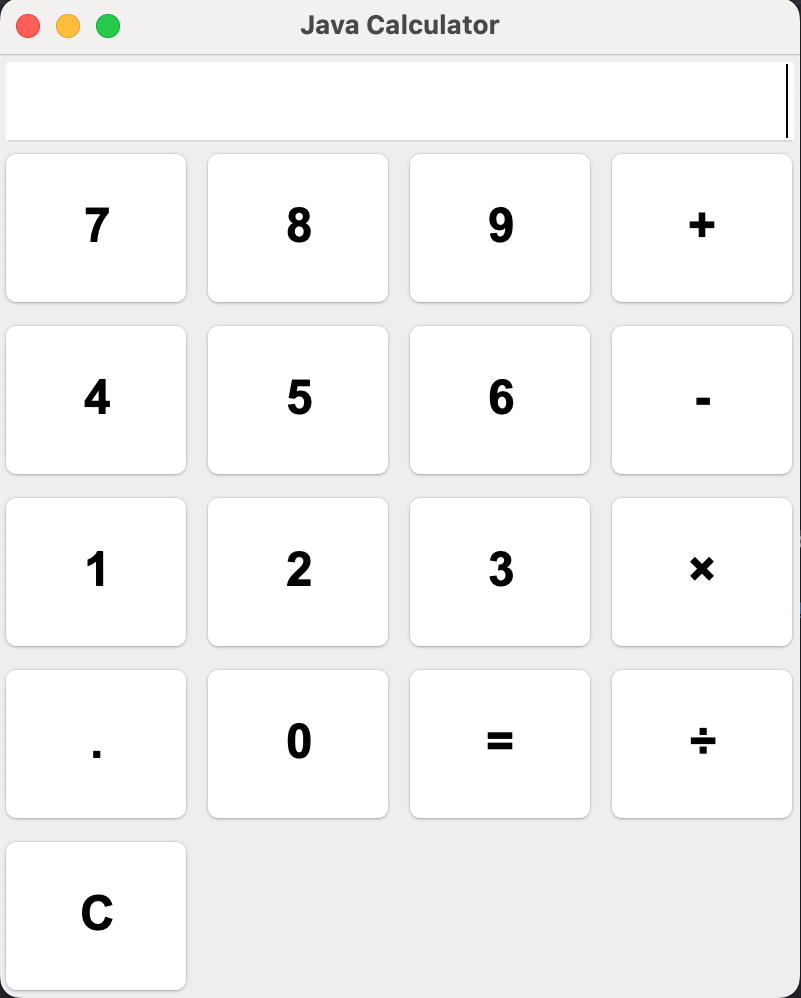

# Java Calculator

A clean and simple calculator built using Java and Swing, designed for basic arithmetic operations with a professional user interface.

## 🖥️ Preview

## 🚀 Features

- Addition, Subtraction, Multiplication, Division
- Error handling (e.g., prevents divide by zero)
- Clean and responsive interface
- Centered window on launch
- Organized code structure (separating UI and logic)

## 🛠️ Technologies Used

- Java
- Java Swing (GUI Framework)

## 📂 Project Structure

